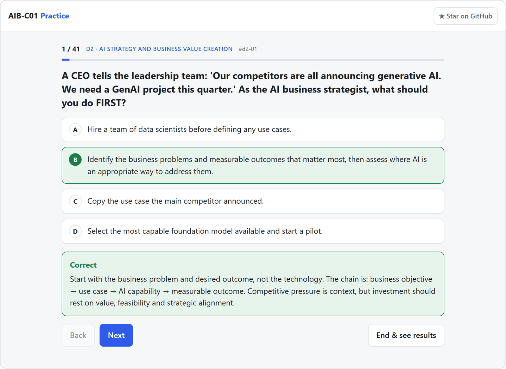
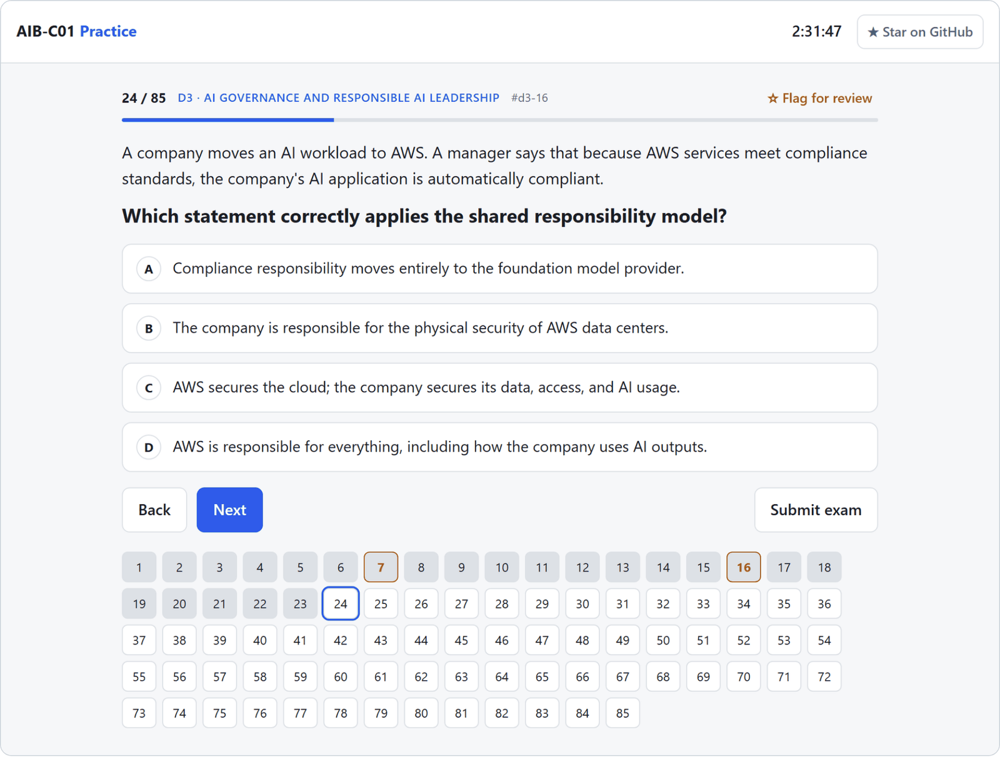
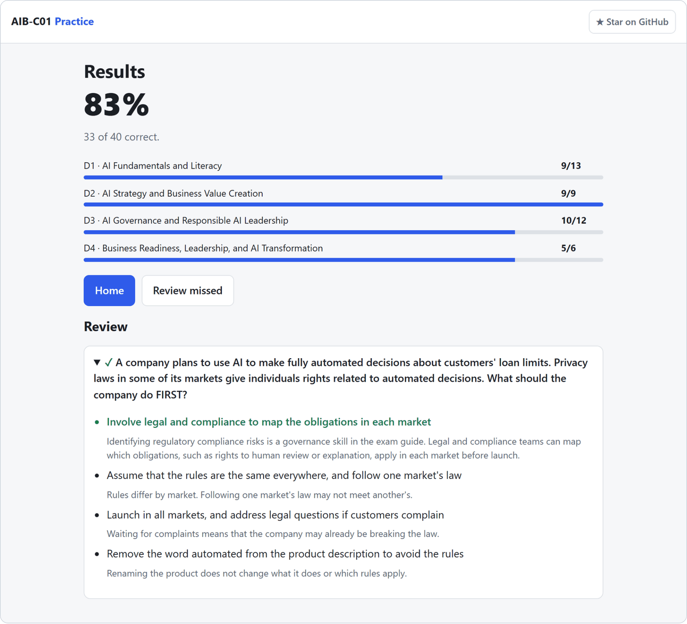

<div align="center">

# AIB-C01 Practice

Free practice questions and a timed mock exam for the **AWS Certified AI Business Strategist (AIB-C01)** exam.<br>
146 original scenario questions, an explanation for every answer, no signup, no ads.

**[Start practicing](https://zghanw.github.io/aws-ai-business-strategist/)** · [Report a wrong answer](https://github.com/zghanw/aws-ai-business-strategist/issues/new/choose) · [Contribute a question](CONTRIBUTING.md)

<a href="https://zghanw.github.io/aws-ai-business-strategist/"></a>
<a href="https://github.com/zghanw/aws-ai-business-strategist/actions/workflows/check.yml"></a>
<a href="https://github.com/zghanw/aws-ai-business-strategist/commits/main"></a>
<a href="LICENSE"></a>

<br><br>

<picture>
  <source media="(prefers-color-scheme: dark)" srcset="docs/screenshots/question-dark.png">
  <source media="(prefers-color-scheme: light)" srcset="docs/screenshots/question-light.png">
  
</picture>

</div>

## Why this exists

The AIB-C01 beta opened on 29 September 2026, and AWS's official practice exam isn't available while the exam is in beta. The free official question set has 20 questions. This site adds 146 more in the same scenario style: business judgment calls, not service trivia.

## What's inside

| Domain | Exam weight | Questions |
|---|---:|---:|
| 1. AI Fundamentals and Literacy | 24% | 35 |
| 2. AI Strategy and Business Value Creation | 28% | 41 |
| 3. AI Governance and Responsible AI Leadership | 24% | 36 |
| 4. Business Readiness, Leadership, and AI Transformation | 24% | 34 |

- Practice one domain at a time and read the explanation right after each answer.
- Take a mock exam in the beta format: 85 questions in 170 minutes, split by the official domain weights.
- Get both multiple-choice and multiple-response questions, like the real exam.
- Come back to the questions you missed. They're saved in your browser.
- Use it on a phone or a laptop, in light or dark mode.

<p align="center">
  <picture>
    <source media="(prefers-color-scheme: dark)" srcset="docs/screenshots/mock-dark.png">
    
  </picture>
  <picture>
    <source media="(prefers-color-scheme: dark)" srcset="docs/screenshots/results-dark.png">
    
  </picture>
</p>

## How the questions are written

Every question is original and written against the public [AIB-C01 exam guide](https://docs.aws.amazon.com/aws-certification/latest/ai-business-strategist-01/ai-business-strategist-01.html). None come from the real exam, paid courses, or dumps. Each explanation says why the right answer is right and why the tempting wrong ones are wrong.

The questions were drafted with AI help, then checked one by one against the exam guide and AWS documentation.

Question bank last reviewed: 29 September 2026.

Think a question is wrong? [Open an issue](https://github.com/zghanw/aws-ai-business-strategist/issues/new/choose) with the question ID shown above each question. You don't need to write any code.

## Run it locally

It's a static site with no build step and no dependencies.

```sh
git clone https://github.com/zghanw/aws-ai-business-strategist.git
cd aws-ai-business-strategist
python -m http.server 8000
```

Then open http://localhost:8000. Run `node check.js` to validate the question bank. CI runs the same check on every push.

## Contributing

Questions live in `data/d1.js` to `data/d4.js`, one file per domain. [CONTRIBUTING.md](CONTRIBUTING.md) covers the format and the ground rules. Issues labeled [good first issue](https://github.com/zghanw/aws-ai-business-strategist/labels/good%20first%20issue) are a good place to start.

If this helped you prepare, a star helps other candidates find it.

## Disclaimer

This is an unofficial study aid, not affiliated with or endorsed by Amazon Web Services. AWS and AWS Certified are trademarks of Amazon.com, Inc. or its affiliates.

## License

[MIT](LICENSE)
